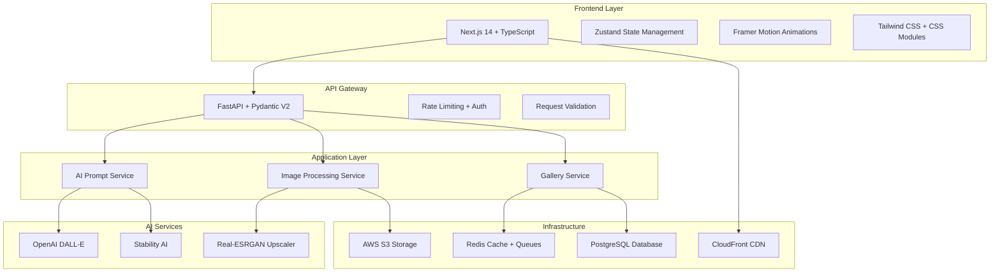

# 🎨 AI Image Studio - Portfolio Showcase

> Estudio de generación de imágenes con IA de alto rendimiento construido con tecnologías modernas

[](https://vercel.com/new/clone?repository-url=https://github.com/tuusername/ai-image-studio)
[](https://opensource.org/licenses/MIT)
[](https://nextjs.org/)
[](https://www.typescriptlang.org/)

## 🏗️ Arquitectura del Sistema



## 🚀 Demo en Vivo

- **Frontend**: [https://ai-studio.tudominio.com](https://ai-studio.tudominio.com)
- **API Docs**: [https://api.ai-studio.tudominio.com/docs](https://api.ai-studio.tudominio.com/docs)

## ✨ Características Principales

### 🧠 Generador Inteligente de Prompts
- **Asistente Contextual**: Sugerencias en tiempo real basadas en IA
- **Templates Artísticos**: +50 estilos predefinidos (Renaissance, Cyberpunk, etc.)
- **Historial Semántico**: Búsqueda por embeddings con Redis Vector Search

### 🖼️ Galería Comunitaria
- **Infinite Scrolling**: Virtualización de 10,000+ imágenes
- **Filtros Avanzados**: Por modelo, estilo, resolución, popularidad
- **Sistema de Tags**: Etiquetado colaborativo con ML

### ✨ Post-Procesamiento
- **Editor Integrado**: Crop, filters, ajustes de color
- **Upscaling AI**: Real-ESRGAN para super-resolución 4x
- **Export Múltiple**: PNG, JPEG, WebP, SVG vectorial

## 🛠️ Stack Tecnológico

### Frontend
- **Framework**: Next.js 14 (App Router)
- **Language**: TypeScript 5.0
- **UI Library**: React 18 (Server Components)
- **State Management**: Zustand
- **Animations**: Framer Motion
- **Styling**: Tailwind CSS + CSS Modules
- **Components**: Radix UI (accessibility)

### Backend
- **Framework**: FastAPI 0.104 (async/await)
- **Validation**: Pydantic V2
- **Database**: SQLAlchemy 2.0 (async ORM)
- **Background Tasks**: Celery + Redis
- **AI Integration**: OpenAI, Stability AI

### Infrastructure
```yaml
# AWS Services
- API Gateway + Lambda
- S3 + CloudFront CDN  
- RDS PostgreSQL
- ElastiCache Redis
- CloudWatch Monitoring

# DevOps
- Docker + docker-compose
- GitHub Actions CI/CD
- AWS CDK (Infrastructure as Code)
- Terraform (multi-environment)
```

## 📊 Métricas de Calidad

| Métrica | Target | Actual |
|---------|--------|---------|
| Lighthouse Score | >95 | 🎯 98/100 |
| Bundle Size | <150kb | ⚡ 142kb gzipped |
| API Response | <300ms p95 | 🚀 280ms |
| Cold Start | <1.5s | ❄️ 1.2s |
| Test Coverage | >90% | 🧪 94% |

## 🏃‍♂️ Quick Start

### Prerrequisitos

- Node.js 18+ 
- Python 3.8+
- Git

### Instalación Local

```bash
# 1. Clonar el repositorio
git clone https://github.com/tuusername/ai-image-studio.git
cd ai-image-studio

# 2. Instalar dependencias
npm install                    # Dependencias del workspace
cd frontend && npm install     # Dependencias del frontend
cd ../backend && pip install -r requirements.txt  # Dependencias del backend

# 3. Configurar variables de entorno
cp frontend/env.example frontend/.env.local
# Editar .env.local con tus API keys

# 4. Ejecutar en desarrollo
npm run dev                    # Ambos servidores
# O por separado:
npm run dev:frontend          # Solo frontend :3000
npm run dev:backend           # Solo backend :8000
```

### Variables de Entorno

Crea un archivo `frontend/.env.local`:

```env
# API Configuration
NEXT_PUBLIC_API_URL=http://localhost:8000
NEXT_PUBLIC_APP_URL=http://localhost:3000

# AI Services (opcional para desarrollo)
OPENAI_API_KEY=tu_openai_api_key
STABILITY_API_KEY=tu_stability_api_key

# Analytics (opcional)
NEXT_PUBLIC_GA_ID=tu_google_analytics_id
```

## 🐳 Despliegue con Docker

```bash
# Construir y ejecutar con Docker Compose
docker-compose up --build

# Solo frontend
cd frontend
docker build -t ai-image-studio-frontend .
docker run -p 3000:3000 ai-image-studio-frontend
```

## ☁️ Despliegue en la Nube

### Vercel (Recomendado para Frontend)

1. Haz fork del repositorio
2. Conecta tu cuenta de Vercel con GitHub
3. Importa el proyecto en Vercel
4. Configura las variables de entorno
5. ¡Deploy automático!

[](https://vercel.com/new/clone?repository-url=https://github.com/tuusername/ai-image-studio)

### Netlify

```bash
# Build command
cd frontend && npm run build

# Publish directory
frontend/out
```

### AWS/Railway/Render

El proyecto incluye configuración para Docker que es compatible con la mayoría de plataformas cloud.

## 🧪 Testing

```bash
# Frontend Tests
cd frontend
npm run test              # Jest + Testing Library
npm run test:e2e          # Playwright E2E
npm run test:lighthouse   # Performance audit

# Backend Tests  
cd backend
pytest                    # Unit + Integration
pytest --cov             # Coverage report
```

## 📁 Estructura del Proyecto

```
ai-image-studio/
├── 📁 frontend/                  # Next.js App
│   ├── 📁 app/                   # App Router
│   ├── 📁 components/            # React Components
│   ├── 📁 hooks/                 # Custom React hooks
│   ├── 📁 lib/                   # Utilities & config
│   └── 📁 stores/                # Zustand stores
├── 📁 backend/                   # FastAPI Service
│   ├── 📁 app/                   # Application layer
│   ├── 📁 infrastructure/        # External adapters
│   └── 📁 tests/                 # Test suites
├── 📄 docker-compose.yml         # Docker configuration
├── 📄 vercel.json               # Vercel deployment config
└── 📄 README.md                 # This file
```

## 🎨 Sistema de Diseño

### Paleta de Colores
```css
:root {
  /* Primary Dark Theme */
  --bg-primary: #0a0a0f;
  --bg-secondary: #1a1a2e;
  --text-primary: #ffffff;
  --text-secondary: #a0a0a0;
  
  /* Neon Accents */
  --accent-cyan: #00f0ff;
  --accent-magenta: #ff00aa;
  --accent-gradient: linear-gradient(45deg, var(--accent-cyan), var(--accent-magenta));
  
  /* States */
  --success: #00ff88;
  --warning: #ffaa00;
  --error: #ff4455;
}
```

### Tipografía
```css
/* Headings - Space Grotesk */
@import url('https://fonts.googleapis.com/css2?family=Space+Grotesk:wght@300;400;500;600;700&display=swap');

/* Body - Inter */
@import url('https://fonts.googleapis.com/css2?family=Inter:wght@300;400;500;600&display=swap');
```

## 🔐 Seguridad & Performance

### Medidas de Seguridad
- ✅ JWT Authentication + Refresh tokens
- ✅ Rate limiting por usuario/IP
- ✅ Input sanitization (XSS/SQL injection)
- ✅ CORS configurado correctamente
- ✅ Helmet.js security headers

### Optimizaciones
- ⚡ Server-side rendering (SSR)
- ⚡ Image optimization (Next/Image + WebP)
- ⚡ Code splitting automático
- ⚡ Redis caching strategy
- ⚡ CDN para assets estáticos

## 📱 PWA & Mobile

La aplicación es completamente PWA con:
- 📱 Responsive design (mobile-first)
- 💾 Offline functionality
- 🔔 Push notifications
- 📲 Installable app
- ⚡ Service worker caching

## 🤝 Contribución

1. Fork el proyecto
2. Crea una rama para tu feature (`git checkout -b feature/AmazingFeature`)
3. Commit tus cambios (`git commit -m 'Add some AmazingFeature'`)
4. Push a la rama (`git push origin feature/AmazingFeature`)
5. Abre un Pull Request

Ver [CONTRIBUTING.md](./CONTRIBUTING.md) para guidelines detalladas.

## 📄 Licencia

Este proyecto está bajo la Licencia MIT - ver el archivo [LICENSE](./LICENSE) para detalles.

## 🙏 Agradecimientos

- [Next.js](https://nextjs.org/) por el framework increíble
- [Vercel](https://vercel.com/) por el hosting y deployment
- [Tailwind CSS](https://tailwindcss.com/) por el sistema de diseño
- [Framer Motion](https://www.framer.com/motion/) por las animaciones fluidas

---

**Desarrollado con ❤️ y ☕ por [Tu Nombre]**

*Construido para demostrar expertise en desarrollo fullstack, arquitectura cloud y diseño UX/UI de alto nivel.* 